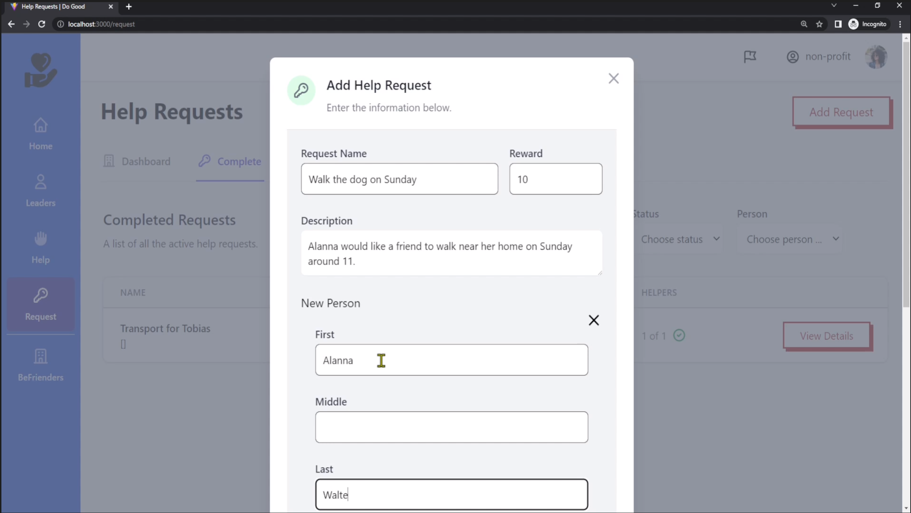

# Internet Computer Hackathon

This project is just a simple ViteJS boilerplate ready to go with a basic example of the Internet Computer application.

- Sign Up with [Internet Identity](https://identity.ic0.app/)
- Create User Profiles with IC User Principle
- Basic CRUD Calls for helpers and help requests

## Video Demo
[](https://vimeo.com/manage/videos/722025893
)

## Stack Used

### Backend
- [Motoko](https://internetcomputer.org/docs/current/motoko/main/motoko)
- [Internet Computer Blockchain](https://internetcomputer.org/)
### Frontend
- [PNPM](https://pnpm.io/)
- [ViteJS](https://vitejs.dev/)
- [React](https://reactjs.org/)
- [Typescript](https://www.typescriptlang.org/)
- [Husky](https://typicode.github.io/husky/#/) & [Lint-staged](https://github.com/okonet/lint-staged)
- [TailwindCSS](https://tailwindcss.com/)

## Getting Started

Install all dependencies with pnpm

```bash
pnpm install
```

Install all dependencies of [ICP](https://internetcomputer.org/docs/current/developer-docs/build/install-upgrade-remove/)

```bash
 sh -ci "$(curl -fsSL https://smartcontracts.org/install.sh)"
```

Start the Replica, deploy the Internet Identity Canister, and depploy the "API" canister and generate the Typescript declarations.  

```bash
 pnpm ic:start-clean
```

Then, run the development server:

```bash
pnpm dev
```

Open [http://localhost:3000](http://localhost:3000) with your browser to see the result.

You can start the replica later using the start script.

```bash
 pnpm ic:start
```

